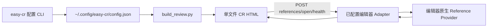

# Easy CR 多编辑器支持技术设计

## 1. 设计目标

Easy CR 只负责把 Diff 中的点击位置安全地交给用户配置的编辑器。符号识别、引用计算和代码打开全部由该编辑器及其已启用的语言插件完成。

页面、CLI 与编辑器扩展之间保持一个稳定协议，GoLand、IntelliJ IDEA 和 VS Code 不分叉 HTML 交互。

## 2. 总体架构



分为三层：

1. **编辑器无关层**
   - 配置、token、endpoint descriptor。
   - HTML 点击位置计算。
   - `/api/references`、`/api/open`、`/api/health` 协议。
   - Git review fingerprint、路径边界和统一错误码。
2. **JetBrains Adapter**
   - GoLand 与 IntelliJ IDEA 共用一份 IntelliJ Platform 插件源码。
   - 使用 PSI 在点击位置解析元素，并使用平台引用搜索能力。
   - 使用 `OpenFileDescriptor` 打开文件、定位并聚焦 IDE。
3. **VS Code Adapter**
   - 运行在 VS Code extension host 内。
   - 使用 `vscode.executeReferenceProvider` 查询当前文件位置的引用。
   - 使用 `showTextDocument` 打开位置，并通过 VS Code 自身 URI/窗口能力激活界面。

## 3. 配置与兼容

### 3.1 配置协议

继续使用版本 1，扩展 editor 枚举：

```json
{
  "version": 1,
  "editor": "idea"
}
```

支持：

```text
none | goland | idea | vscode
```

编辑器 descriptor 固定在代码中，不允许 HTML 或用户配置覆盖 endpoint：

| Editor | Endpoint | Adapter |
|---|---|---|
| `goland` | `http://127.0.0.1:64343` | JetBrains |
| `idea` | `http://127.0.0.1:64344` | JetBrains |
| `vscode` | `http://127.0.0.1:64345` | VS Code |

独立端口用于避免 GoLand、IDEA 和 VS Code 同时打开时争抢监听地址。一个 HTML 只嵌入生成时选中的 descriptor，因此只会调用对应编辑器。

### 3.2 Token

- 首期继续复用现有 `~/.config/easy-cr/goland-token`，把它视为兼容保留的共享本机 token 文件。
- 新增代码统一命名为 `EDITOR_TOKEN_PATH`，但路径不迁移、不复制、不删除，确保旧 GoLand 插件和旧 HTML 可用。
- 所有 adapter 只读取该文件，要求目录 `0700`、文件 `0600`。
- `status/doctor` 只输出存在性和权限状态，不输出 token。

### 3.3 HTML semantic payload

生成器写入：

```json
{
  "mode": "editor",
  "editor": "vscode",
  "displayName": "Visual Studio Code",
  "endpoint": "http://127.0.0.1:64345",
  "token": "..."
}
```

旧 HTML 已经自包含 `mode=goland` 和旧 endpoint，不受新模板影响。新模板同时兼容旧 `goland` mode 和新 `editor` mode。

## 4. 位置驱动协议

### 4.1 HTML 点击位置

移除生成阶段的 Go 关键字表、`.go` 限制和 `code-identifier` span。

Command+点击时：

1. 只接受新增行和上下文行；删除行、hunk、meta、空路径不触发。
2. 使用浏览器 caret position API 获取被点击文本节点与 UTF-16 offset。
3. 去掉 Diff 行首的 `+` 或空格。
4. 将点击位置之前的字符串按 UTF-8 编码，得到 1-based byte column。
5. 发送 `filePath + line + column`，不发送由 HTML 解析的 symbol。

如果浏览器不支持 caret position API，展示“当前浏览器无法解析点击位置”，不降级为文本搜索。

### 4.2 References

```json
POST /api/references
{
  "token": "...",
  "projectPath": "/repo",
  "reviewType": "worktree",
  "fingerprint": "...",
  "base": "HEAD^",
  "context": 10,
  "filePath": "service/example.go",
  "line": 42,
  "column": 18
}
```

返回：

```json
{
  "symbol": "ConfirmProposal",
  "opened": false,
  "references": [
    {
      "path": "handler.go",
      "line": 108,
      "column": 12,
      "preview": "return svc.ConfirmProposal(ctx, req)"
    }
  ]
}
```

adapter 从编辑器语义模型得出 `symbol`。若 provider 不存在，返回稳定错误：

```json
{
  "code": "REFERENCE_PROVIDER_UNAVAILABLE",
  "error": "当前编辑器没有为该文件提供引用查询能力"
}
```

0/1/N 规则保持不变：

- 0 个引用：打开当前点击位置。
- 1 个引用：直接打开唯一引用位置。
- N 个引用：不切换编辑器，HTML 展示列表，用户选择后调用 `/api/open`。

### 4.3 Open 与 Health

`/api/open` 继续接收仓库相对路径、行和列。

`/api/health` 增加 editor：

```json
{
  "ready": true,
  "plugin": "easy-cr",
  "editor": "idea",
  "protocolVersion": 2
}
```

CLI 必须校验返回 editor 与当前配置一致，避免端口或安装配置错误。

## 5. JetBrains Adapter

### 5.1 代码复用

- 将 `goland-plugin` 重命名为 `jetbrains-plugin`。
- `EasyCrHttpService`、Git 校验、CORS/token、路径校验和打开代码逻辑共用。
- 运行时通过打包资源读取 `editorId` 和 `port`，构建 GoLand/IDEA 两个安装包，避免源码复制。
- `plugin.xml` 仅依赖 `com.intellij.modules.platform` 和通用语言能力，不再强依赖 `org.jetbrains.plugins.go`。

### 5.2 引用查询

- 使用点击位置获取 PSI leaf。
- 优先解析 leaf/current element 的 `PsiReference.resolve()`；声明位置使用最近的 `PsiNamedElement`。
- 对解析出的目标使用 IntelliJ Platform `ReferencesSearch.search`。
- 结果仅保留当前 project root 下的普通文件。
- 不判断文件扩展名或语言；没有 PSI/reference provider 时返回 `REFERENCE_PROVIDER_UNAVAILABLE`。

### 5.3 IDEA 安装

新增统一脚本：

```text
setup_jetbrains_plugin.py --editor goland
setup_jetbrains_plugin.py --editor idea
```

脚本职责：

- 检测 `/Applications/GoLand.app`、`/Applications/IntelliJ IDEA.app`。
- 选择匹配的 JetBrains Application Support 插件目录。
- 使用目标 IDE 自带 JBR 和 platform libraries 构建。
- 原子替换 `plugins/easy-cr`。
- 不自动重启 IDE。

## 6. VS Code Adapter

### 6.1 扩展结构

新增：

```text
skills/easy-cr/assets/vscode-extension/
├── package.json
├── tsconfig.json
├── src/
│   ├── extension.ts
│   ├── server.ts
│   ├── reviewValidation.ts
│   └── protocol.ts
└── test/
```

扩展启动后仅监听 `127.0.0.1:64345`，不注册外部可配置 endpoint。

### 6.2 引用与跳转

- 用 workspace folder 精确匹配 `projectPath`。
- 将 UTF-8 byte column 转换为 VS Code 的 UTF-16 `Position`。
- 调用 `vscode.executeReferenceProvider(document.uri, position)`。
- 过滤 workspace 外位置并生成预览。
- `/api/open` 使用 `workspace.openTextDocument` 与 `window.showTextDocument`。
- 打开后选中目标位置并 reveal。
- 若浏览器焦点仍未切换，使用 VS Code 自身 URI scheme 激活当前应用，不调用用户可配置 shell 命令。

### 6.3 安装

CLI 构建 `.vsix`，优先调用检测到的 `code` 命令：

```text
code --install-extension easy-cr.vsix --force
```

若找不到 `code`，提示用户在 VS Code 中启用 “Shell Command: Install 'code' command in PATH”，不直接修改应用目录。

不声明具体语言扩展依赖；支持范围由用户当前 VS Code 的 reference provider 决定。

## 7. CLI 与诊断

### 7.1 命令

```text
easy-cr init --editor none|goland|idea|vscode
easy-cr config editor <none|goland|idea|vscode>
easy-cr status [--json]
easy-cr doctor [--json]
```

editor registry 统一描述：

```python
EditorDescriptor(
    id="vscode",
    display_name="Visual Studio Code",
    endpoint="http://127.0.0.1:64345",
    installer=install_vscode,
    detector=detect_vscode,
    health=check_health,
)
```

`configure_editor`、`collect_status` 和 `build_doctor_checks` 只访问 registry，不再写 `if editor == goland` 分支。

### 7.2 Doctor

每个 editor 统一检查：

1. 应用是否安装。
2. 安装命令/插件目录是否可用。
3. Easy CR adapter 是否已安装。
4. token 是否存在且权限正确。
5. `/api/health` 是否可达。
6. editor/protocolVersion 是否匹配。
7. 当前项目是否在该编辑器中打开。

语言 provider 是否可用只能针对具体文件和位置判断，因此不放在静态 health；查询时返回明确错误。

## 8. 安全、兼容与回滚

- 所有 server 只监听 loopback。
- 继续限制 `Origin` 为 `null` 或 loopback HTTP。
- 请求体上限、token 恒定时间比较、路径 realpath 校验和 Git fingerprint 校验三端一致。
- 文件范围从 `.go` 扩展为仓库内 UTF-8 普通文件；二进制、目录、symlink 逃逸和超大文件拒绝。
- 新模板出错时可切回 `easy-cr config editor none`，基础 HTML 不受 adapter 影响。
- 每个 editor 独立端口和安装包，可以单独回滚；GoLand 64343 与旧 token 文件保持不变。

## 9. 关键取舍

### 采用位置协议，不采用语言识别

优点：

- Easy CR 不需要维护多语言词法规则。
- 自动复用用户编辑器已经安装的语言能力。
- HTML 与协议长期稳定。

代价：

- 同一文件在不同编辑器中的引用结果可能不同。
- provider 未安装或索引未完成时只能给出编辑器错误，Easy CR 不提供文本搜索降级。

### 每个编辑器独立端口，不采用自动发现

优点：

- 配置可审计、HTML 无任意 endpoint、多个编辑器同时运行不冲突。
- 不需要额外 registry/helper 进程。

代价：

- 新增编辑器需要分配固定端口并发布新 descriptor。
