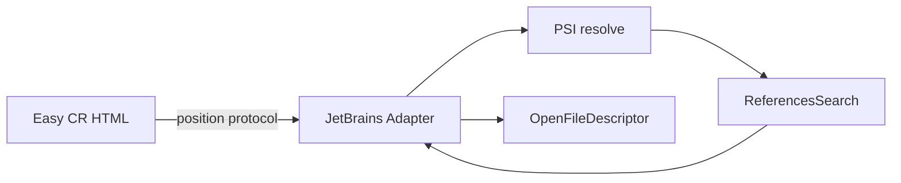

# Easy CR IntelliJ IDEA 技术设计

## Architecture



HTML 只计算仓库相对路径、行号和 UTF-8 byte column。JetBrains Adapter 负责将位置转换为文档 offset、解析 PSI target、搜索引用并打开文件。

## Shared Protocol

新请求不包含 HTML 推断的 symbol：

```json
{
  "token": "...",
  "projectPath": "/repo",
  "reviewType": "worktree",
  "fingerprint": "...",
  "base": "HEAD^",
  "context": 10,
  "filePath": "src/service.go",
  "line": 42,
  "column": 18
}
```

响应允许 `symbol` 为空，由 Adapter 尽力从 PSI named element 获取：

```json
{
  "symbol": "ConfirmProposal",
  "opened": false,
  "references": []
}
```

`/api/health` 返回：

```json
{
  "ready": true,
  "plugin": "easy-cr",
  "editor": "idea",
  "protocolVersion": 2
}
```

## JetBrains Plugin

- 将 `assets/goland-plugin` 重构为 `assets/jetbrains-plugin`。
- HTTP server、review validation、reference conversion 和 navigation 分离成可测试组件。
- 使用 `PsiFile.findElementAt()`、`PsiReference.resolve()` 和最近的 `PsiNamedElement` 解析 target。
- 使用平台 `ReferencesSearch.search(target, GlobalSearchScope.projectScope(project))`。
- 结果只保留当前 project root 内普通文件，最多 500 条。
- `plugin.xml` 声明 `com.intellij.modules.platform` 与 `com.intellij.modules.lang`。
- 同一源码构建两个 variant，通过资源注入 `editorId`、`port` 和 token filename。

## Build and Install

使用 IntelliJ Platform Gradle Plugin 2.x 管理平台和测试依赖，提供：

```text
buildPlugin
runIde
verifyPlugin
```

统一安装入口：

```bash
setup_jetbrains_plugin.py --editor goland
setup_jetbrains_plugin.py --editor idea
```

安装器根据 editor descriptor 查找应用、JBR 和 Application Support 插件目录，原子替换 `plugins/easy-cr`，但不主动重启 IDE。

## Security

- endpoint 和端口只能来自内置 registry。
- 每个编辑器使用独立 token；旧 GoLand token 保留。
- 继续限制 loopback、POST、JSON content type、body size 和 CORS origin。
- 每次 references/open 都重新校验 project root、Git fingerprint 和真实路径。
- health 同时校验 token、editor 和 protocol version，避免错误实例响应。

## Risks

- 某些语言插件对 `ReferencesSearch` 的实现存在差异：以 Java、Go 两种语言做契约测试，并用 Plugin Verifier 检查 API。
- PSI 必须在 read action 中访问，UI 打开必须回到 EDT。
- HTML caret offset 与 IDE UTF-16 offset 不一致：共享 fixture 覆盖中文、emoji、tab 和行首 Diff marker。

## Official References

- https://plugins.jetbrains.com/docs/intellij/plugin-compatibility.html
- https://plugins.jetbrains.com/docs/intellij/references-and-resolve.html
- https://plugins.jetbrains.com/docs/intellij/developing-plugins.html
- https://plugins.jetbrains.com/docs/intellij/verifying-plugin-compatibility.html
