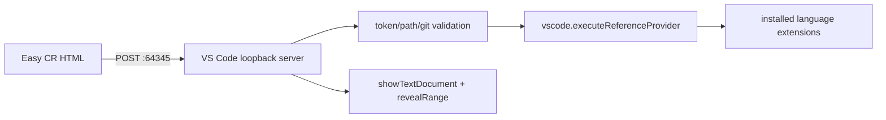

# Easy CR VS Code Adapter 技术设计

## Architecture



扩展运行在 VS Code Desktop 的本地 extension host。它只负责协议、安全校验和调用 VS Code 已有语言能力。

## Extension Layout

```text
skills/easy-cr/assets/vscode-extension/
├── package.json
├── tsconfig.json
├── esbuild.js
├── .vscodeignore
├── src/
│   ├── extension.ts
│   ├── server.ts
│   ├── protocol.ts
│   ├── position.ts
│   └── reviewValidation.ts
└── test/
```

`package.json` 声明 desktop Node entry 和 VS Code engine，不声明具体语言扩展依赖。激活后，如果 `vscode.env.remoteName` 非空，则只报告 unsupported，不启动远端 loopback。

## References

1. 用 `projectPath` 精确匹配 `workspace.workspaceFolders`。
2. 使用 `workspace.openTextDocument(uri)` 获得 Document。
3. 将 1-based UTF-8 byte column 转为 0-based UTF-16 `Position`。
4. 调用：

```ts
vscode.commands.executeCommand<vscode.Location[]>(
  "vscode.executeReferenceProvider",
  document.uri,
  position
)
```

5. 过滤 workspace 外引用，读取对应行生成 preview，最多返回 500 条。
6. 空数组按零引用处理；不声称能识别 provider 是否存在。

## Open and Focus

使用 `openTextDocument` 和 `showTextDocument` 打开文件，设置 selection 并调用 `revealRange`。是否能从浏览器可靠抢占系统焦点必须做 macOS、Windows 实机验证；不执行用户可配置 shell 命令。必要时由 HTML 使用官方 `vscode://file/...:line:column` URL 作为显式用户手势降级。

## Security

- 只监听 `127.0.0.1:64345`。
- token 使用 `~/.config/easy-cr/vscode-token`，文件权限遵循现有规则。
- endpoint、body limit、origin、HTTP method 和 content type 固定。
- 所有路径经过 URI/realpath/workspace root 三重校验。
- references/open 前重新计算 review fingerprint。
- health 返回 `editor=vscode` 和 `protocolVersion=2`。

## Build and Distribution

- 使用 esbuild 生成单文件 extension bundle。
- 使用 `@vscode/test-electron` 运行集成测试。
- 使用 `@vscode/vsce` 生成 `.vsix`。
- CLI 调用 `code --install-extension --force`；找不到 `code` 时提示用户启用 Shell Command。
- npm 包只包含运行时 bundle、manifest 和安装器需要的资源，不包含 node_modules。

## Official References

- https://code.visualstudio.com/api/references/commands
- https://code.visualstudio.com/api/advanced-topics/extension-host
- https://code.visualstudio.com/api/working-with-extensions/bundling-extension
- https://code.visualstudio.com/api/working-with-extensions/publishing-extension
- https://code.visualstudio.com/docs/configure/command-line
